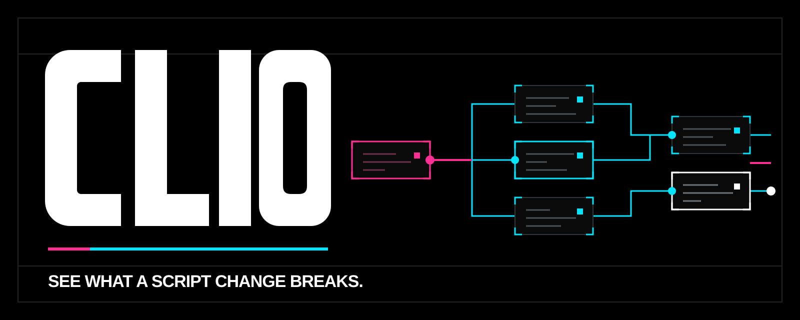
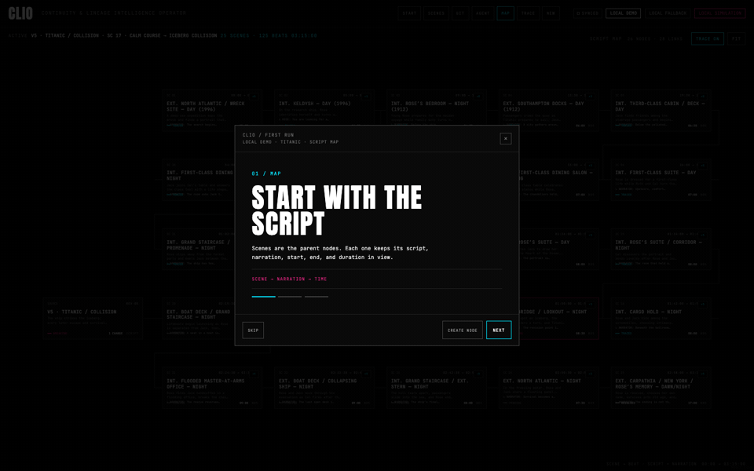
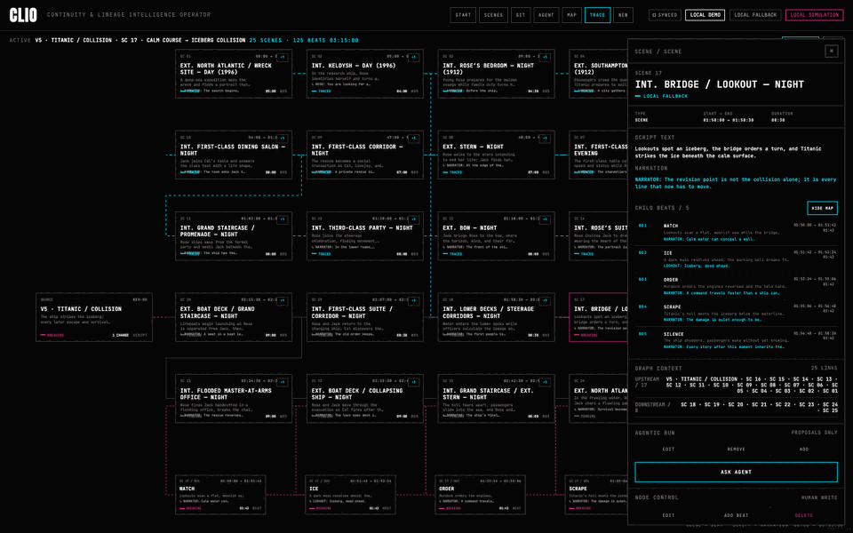
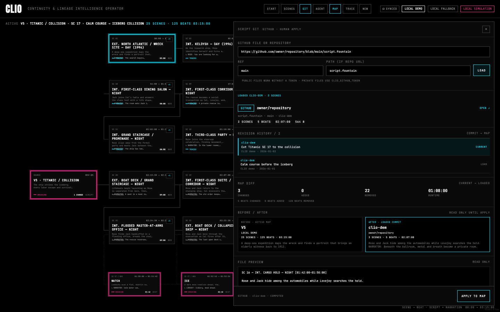

  

  
<strong>CLIO — Continuity &amp; Lineage Intelligence Operator</strong>

  
<strong>See what a script change breaks.</strong>

  
<em>CLIO helps editors trace a screenplay revision through scenes, timed beats, and runtime before they change the cut.</em>

  

    
    
    
  

  

    
    
    
    
  

  

    <a href="https://clio-agentic.web.app/">Live app</a> ·
    <a href="docs/submission-description.md">Submission description</a> ·
    <a href="docs/assets/clio-workflow.gif">Workflow GIFs</a> ·
    <a href="docs/workflow.md">Technical workflow</a>
  

<kbd>Contents</kbd>

- [The problem](#the-problem)
- [How CLIO helps](#how-clio-helps)
- [See it in action](#see-it-in-action)
- [A clear editorial loop](#a-clear-editorial-loop)
- [Try CLIO](#try-clio)
- [Run locally](#run-locally)
- [Verify](#verify)
- [Project map](#project-map)
- [License](#license)

## The problem

A screenplay revision is rarely just one changed line. It can alter a later
payoff, make a beat unnecessary, introduce a continuity risk, or change the
runtime of a sequence. Finding that chain usually means searching through
versions, notes, and memory.

CLIO turns the question into something an editor can inspect:

> What depends on this change, and what should I review before I decide?

## How CLIO helps

| See the change | Inspect the scene | Follow the impact | Make the call |
| --- | --- | --- | --- |
| Keep a revision source, 25 scenes, and 125 timed beats on one map. | Open a scene into its timed beats without losing the film-wide view. | Trace connected scenes, timing, narration, and action before acting. | Review an evidence-backed proposal, then edit, keep, or compare the script yourself. |

The agent can explain a relationship, model an edit, estimate a removal, or
suggest a connection. Its output is a proposal for review—not an automatic
screenplay change.

## See it in action

| Script impact walkthrough | Evidence-to-decision loop |
| --- | --- |
|  |  |
| Follow one revision through the screenplay map. | See the evidence pass end at an editor decision. |

Together, these two loops follow a fictional 25-scene film map from a revision
to a reviewed decision.

| Moment | What the editor sees |
| --- | --- |
| <strong>Map</strong> | The V5 source revision beside the full screenplay map. |
| <strong>Inspect</strong> | SC 17 expanded into timed beats with its action and narration. |
| <strong>Review</strong> | A proposal with the context behind its recommendation. |
| <strong>Compare</strong> | A loaded screenplay source held for review before it can update the map. |

  

## A clear editorial loop

1. Open a source revision and select the scene in question.
2. Expand its beats and trace the connected path.
3. Ask CLIO to explain, model, remove, or add.
4. Read the evidence and choose the next editorial action.

| CLIO prepares | The editor decides |
| --- | --- |
| Linked scenes, beats, timing, and revision context. | Whether the connection is editorially meaningful. |
| An explanation or proposed consequence. | Whether to retain, edit, remove, or add material. |
| A comparison with a loaded screenplay source. | Whether to apply that source to the map. |

## Try CLIO

- [Open the live app](https://clio-agentic.web.app/)
- [Open the workspace](https://clio-agentic.web.app/workspace)
- [Read the submission description](docs/submission-description.md)
- [Read the technical workflow](docs/workflow.md)
- [Browse the source](https://github.com/azharizz/CLIO)

Suggested review path:

1. Enter the workspace and inspect the V5 collision revision.
2. Select SC 17, then choose <strong>SHOW MAP</strong> to reveal its beats.
3. Open <strong>AGENT</strong>, choose <strong>EXPLAIN</strong>, and review the evidence.
4. Open <strong>GIT</strong> to compare the current map with a loaded source.

## Run locally

Requirements: Node 22, pnpm, Python 3.13, and Docker Desktop or Engine when
you want to run the local ClickHouse store.

From the repository root:

~~~bash
pnpm install

# Optional terminal 1: local ClickHouse
docker compose -f infra/docker-compose.yml up -d

# Terminal 2: FastAPI
cd backend
python3.13 -m venv .venv
source .venv/bin/activate
python -m pip install -e '.[test]'
CLIO_DATABASE_MODE=local CLIO_CLICKHOUSE_HOST=127.0.0.1 \
CLIO_CLICKHOUSE_PORT=8123 CLIO_CLICKHOUSE_USER=clio \
CLIO_CLICKHOUSE_PASSWORD=clio-local CLIO_CLICKHOUSE_DATABASE=filmgraph \
CLIO_CLICKHOUSE_SECURE=false uvicorn filmgraph.main:app \
  --host 127.0.0.1 --port 8000 --reload

# Terminal 3: TanStack Start
cd ..
pnpm dev
~~~

Open [http://127.0.0.1:3000](http://127.0.0.1:3000). For provider, deployment,
and GitHub configuration, copy [.env.example](.env.example) to a local
environment file and read [docs/workflow.md](docs/workflow.md).

## Verify

~~~bash
pnpm typecheck
pnpm test
pnpm e2e
pnpm build
cd backend && .venv/bin/python -m pytest -q
git diff --check
~~~

Regenerate the workflow captures after a material UI change:

~~~bash
CLIO_CAPTURE_DIR="$PWD/docs/screenshots" pnpm capture
~~~

## Project map

| Path | Purpose |
| --- | --- |
| [src/routes/index.tsx](src/routes/index.tsx) | Screenplay workspace, graph controls, trace state, agent overlay, and Script Git entry point. |
| [src/components/](src/components/) | Graph, inspector, editor, onboarding, agent, decision, and Git interface components. |
| [src/lib/workspace.ts](src/lib/workspace.ts) | Browser workspace state, fallback snapshot, graph mapping, and event handling. |
| [backend/filmgraph/](backend/filmgraph/) | API, graph repositories, Script Git integration, agent integration, and ClickHouse adapters. |
| [agent_runtime/](agent_runtime/) | Agent-runtime integration and deployment helper. |
| [infra/](infra/) | Local ClickHouse, Firebase, and Cloud deployment material. |
| [docs/screenshots/](docs/screenshots/) | Workflow captures used in this README and the animated walkthrough. |
| [docs/workflow.md](docs/workflow.md) | Detailed runtime, graph model, configuration, and screenshot reference. |
| [docs/submission-description.md](docs/submission-description.md) | Submission-ready product overview with visual proof. |

## License

CLIO is licensed under [Apache-2.0](LICENSE). The repository includes a
fictional storyboard for demonstration. Verify permissions before using
third-party screenplay, provider, or brand material.
